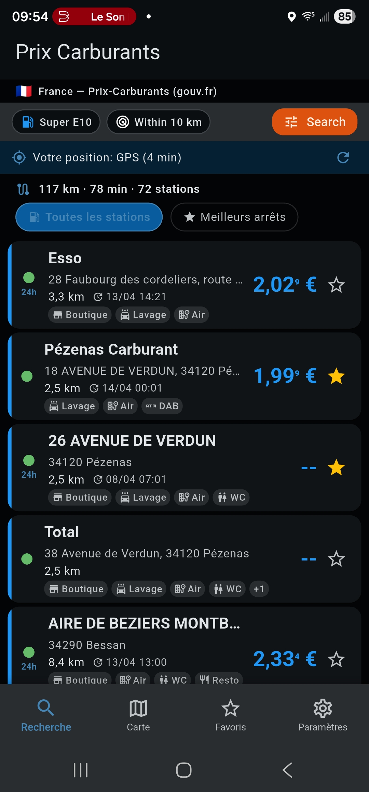
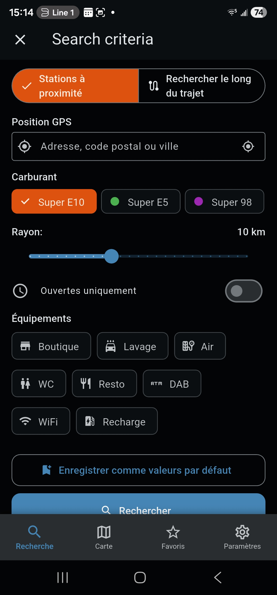
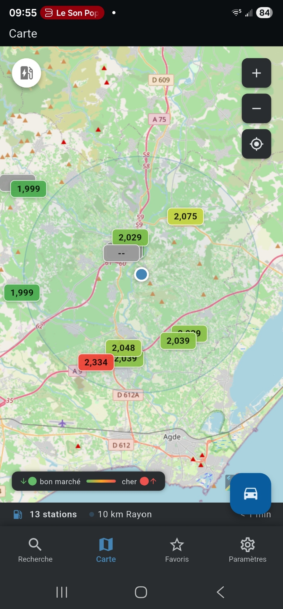
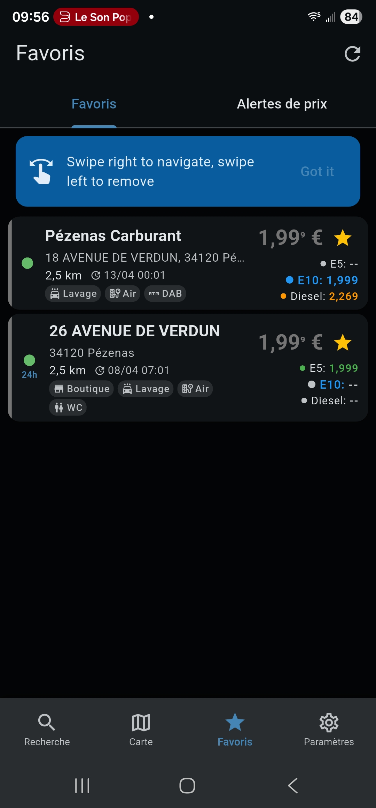
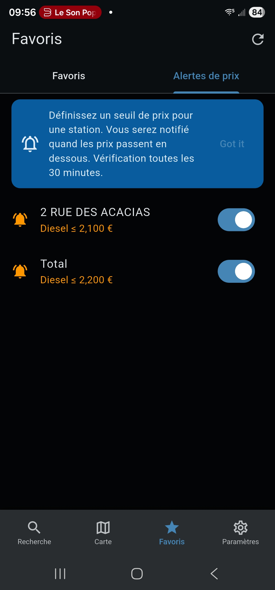
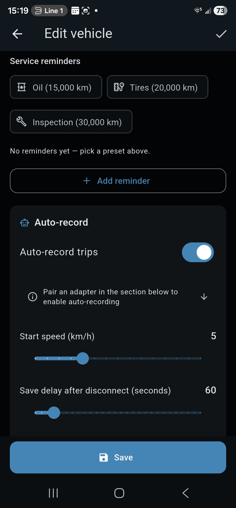
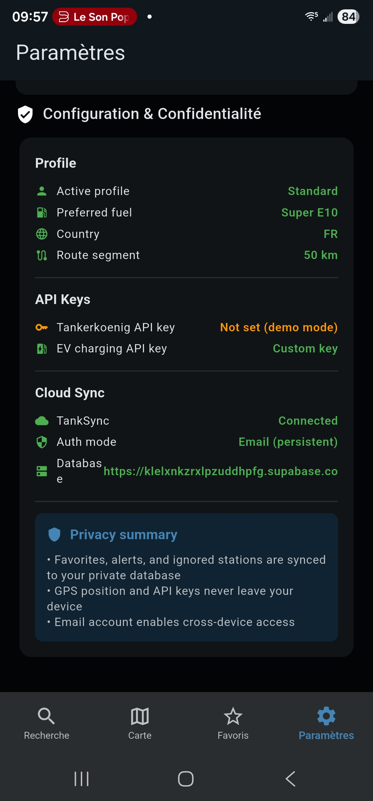

# Tankstellen

> **Smarter pump. Smarter drive. Save twice.**
>
> Every litre saved at the pump is a litre not burned on the road — and a kilogram of CO₂ you kept out of the air. Tankstellen is built to help you save both ways: cheaper fuel _and_ leaner driving.

[](https://github.com/fdittgen-png/tankstellen/actions/workflows/ci.yml)
[](LICENSE)
[](https://flutter.dev)

**Free fuel-price comparison for Europe and beyond** — 11 countries, 23 languages, privacy-first.

Tankstellen helps drivers find the cheapest fuel nearby, along a route, or in a specific city, _and_ track their real consumption so they can drive it down over time. It aggregates real-time prices from official government APIs — no scraping, no tracking, no ads.

### The two savings lenses

1. **At the pump.** Live price comparison across countries, along your route, with alerts when prices drop.
2. **Behind the wheel.** Fill-up log, consumption stats, CO₂ dashboard, and the signals you need to drive more economically over time.

Every feature in the app serves at least one of these two lenses. Features that serve neither don't belong.

## Features

- **Real-time prices** from official government data sources
- **11 countries** — Germany, France, Austria, Spain, Italy, Denmark, Portugal, UK, Argentina, Australia, Mexico
- **23 languages** — from Bulgarian to Swedish
- **Route search** — find the cheapest station along your planned route, with saved itineraries
- **EV charging** — OpenChargeMap integration with connector type, max power, and pricing
- **Driving mode** — full-screen, in-car friendly map with large markers and voice announcements
- **Vehicle profiles** — combustion, hybrid, or EV; battery, connectors, tank capacity
- **Fuel consumption tracking** — log fill-ups manually, by **receipt scan** (OCR), or via **OBD-II** (ELM327)
- **Calculator** — tank fill cost, cross-station savings, fuel budget projections
- **Carbon dashboard** — CO₂ emissions per vehicle with 30-day rolling chart
- **Price alerts** — get notified when prices drop below your threshold
- **Price history & predictions** — 30-day charts and "best time to fill" analysis
- **Brand registry & filter** — country-specific brand recognition, filter by Total / Esso / Shell / etc.
- **Landing screen selection** — open the app to nearest, cheapest, favorites, or map
- **Favorites** — quick access to your regular stations with swipe actions
- **Home screen widget** — see prices without opening the app
- **Offline-capable** — local-first architecture with smart caching
- **Cross-device sync** — optional TankSync cloud backend (self-hostable via Supabase)
- **Privacy-first** — no Firebase, no Google Play Services, no tracking, GDPR-compliant
- **Accessibility** — meets Android tap target guidelines, semantic labels throughout

## Screenshots

Captured on a Samsung S23 Ultra running the **Play** flavour against the live `Prix Carburants` (France) API.

| Search results | Search criteria | Map view |
|:--:|:--:|:--:|
|  |  |  |
| Real-time prices ranked by distance, with brand-specific 24h / amenity badges. | Modal sheet for switching between nearby and along-route searches and tweaking filters. | Interactive map with color-coded price markers and a one-tap "driving mode" launcher. |

| Favorites | Price alerts | Profile edit |
|:--:|:--:|:--:|
|  |  |  |
| Saved stations with multi-fuel pricing and swipe-to-navigate / swipe-to-remove gestures. | Threshold-based price alerts that fire once per 30-min background check. | Per-profile preferred fuel, default radius, route segment, and station rating privacy mode. |

| Settings & privacy |   |   |
|:--:|:--:|:--:|
|  |   |   |
| Configuration & privacy summary: profile, API keys, TankSync auth mode, and a one-glance privacy statement. |   |   |

## Getting Started

### Prerequisites

- [Flutter SDK](https://docs.flutter.dev/get-started/install) (stable channel, 3.41+)
- Android SDK with at least one emulator or connected device
- JDK 17

### Setup

```bash
# Clone the repository
git clone https://github.com/fdittgen-png/tankstellen.git
cd tankstellen

# Install dependencies
flutter pub get

# Run code generation
dart run build_runner build --delete-conflicting-outputs

# Launch on a connected device or emulator
flutter run
```

### API Keys

Tankstellen uses official government fuel price APIs. Some require a free API key:

| Country | API | Key Required |
|---------|-----|:------------:|
| Germany | [Tankerkoenig](https://creativecommons.tankerkoenig.de/) | Yes (free) |
| France | [Prix Carburants](https://www.prix-carburants.gouv.fr/) | No |
| Austria | [E-Control](https://www.e-control.at/) | No |
| Spain | [MiTECO](https://sedeaplicaciones.mineco.gob.es/) | No |
| Italy | [MISE](https://dgsaie.mise.gov.it/) | No |

Keys are stored securely on-device (Android Keystore) — never embedded in source code.

## Architecture

```
lib/
  app/              # App entry, routing, theme
  core/
    cache/          # Unified CacheManager with TTLs
    services/       # Abstract interfaces + country implementations
    storage/        # Hive local storage
    sync/           # TankSync cloud backend (optional)
    error_tracing/  # Structured error capture
  features/
    search/         # City/postal code search
    map/            # Interactive map with clustering
    favorites/      # Saved stations with swipe actions
    alerts/         # Price drop notifications
    calculator/     # Trip cost calculator
    price_history/  # 30-day charts & predictions
    route_search/   # Along-the-route cheapest station
    station_detail/ # Station info, prices, reports
    profile/        # Settings & preferences
    sync/           # Cross-device sync UI
    widget/         # Home screen widget
    ...
```

**Key patterns:**
- Feature-first clean architecture with data / domain / presentation layers
- Riverpod 3.0 with code generation for state management
- Service abstraction with 4-step fallback: fresh cache → API → stale cache → error
- All API responses wrapped in `ServiceResult<T>` with source tracking

## Development

```bash
# Run tests
flutter test

# Run tests with coverage
flutter test --coverage

# Static analysis (must pass with zero warnings)
flutter analyze

# Code generation (after changing models/providers)
dart run build_runner build --delete-conflicting-outputs

# Build release APK
flutter build apk --release
```

### Adding a New Country

The app is designed to be easily extensible. Each country has its own service implementation behind the `StationService` interface. See `lib/core/services/impl/` for examples.

## Tech Stack

| Layer | Technology |
|-------|-----------|
| Framework | Flutter 3.41 / Dart 3.11 |
| State | Riverpod 3.0 with code generation |
| Storage | Hive (local-first) + optional Supabase |
| Networking | Dio 5.x with interceptors |
| Maps | flutter_map + OpenStreetMap (no Google dependency) |
| Data Classes | Freezed + json_serializable |
| Background | WorkManager for periodic alert checks |
| CI/CD | GitHub Actions — analyze, test, build, release |

## Contributing

Contributions are welcome! See [docs/CONTRIBUTING.md](docs/CONTRIBUTING.md) for detailed guidelines.

**Quick summary:**

1. Open an issue first — describe the bug or feature before writing code
2. Branch from `master` — use conventional branch names (`feat/`, `fix/`, `refactor/`)
3. Write tests — every change needs tests
4. Run checks — `flutter analyze` and `flutter test` must pass
5. Keep PRs small — under 400 lines changed (excluding generated files)
Contributions are welcome! Please follow these guidelines:

1. **Open an issue first** — describe the bug or feature before writing code
2. **Branch from `master`** — use conventional branch names (`feat/`, `fix/`, `refactor/`)
3. **Write tests** — every change needs tests (unit, widget, or integration)
4. **Run checks** — `flutter analyze` and `flutter test` must pass
5. **Keep PRs small** — under 400 lines changed (excluding generated files)
6. **Conventional commits** — `feat:`, `fix:`, `docs:`, `refactor:`, `test:`, `chore:`

### Commit Messages

```
feat: add price alerts for Portugal stations
fix: prevent duplicate API calls during rapid scroll
refactor: extract cache TTL constants to config
```

## License

This project is licensed under the MIT License — see the [LICENSE](LICENSE) file for details.

## Acknowledgments

- Fuel price data provided by official government APIs of each supported country
- Maps powered by [OpenStreetMap](https://www.openstreetmap.org/) contributors
- Built with [Flutter](https://flutter.dev) and the amazing Dart ecosystem
