<p align="center">
  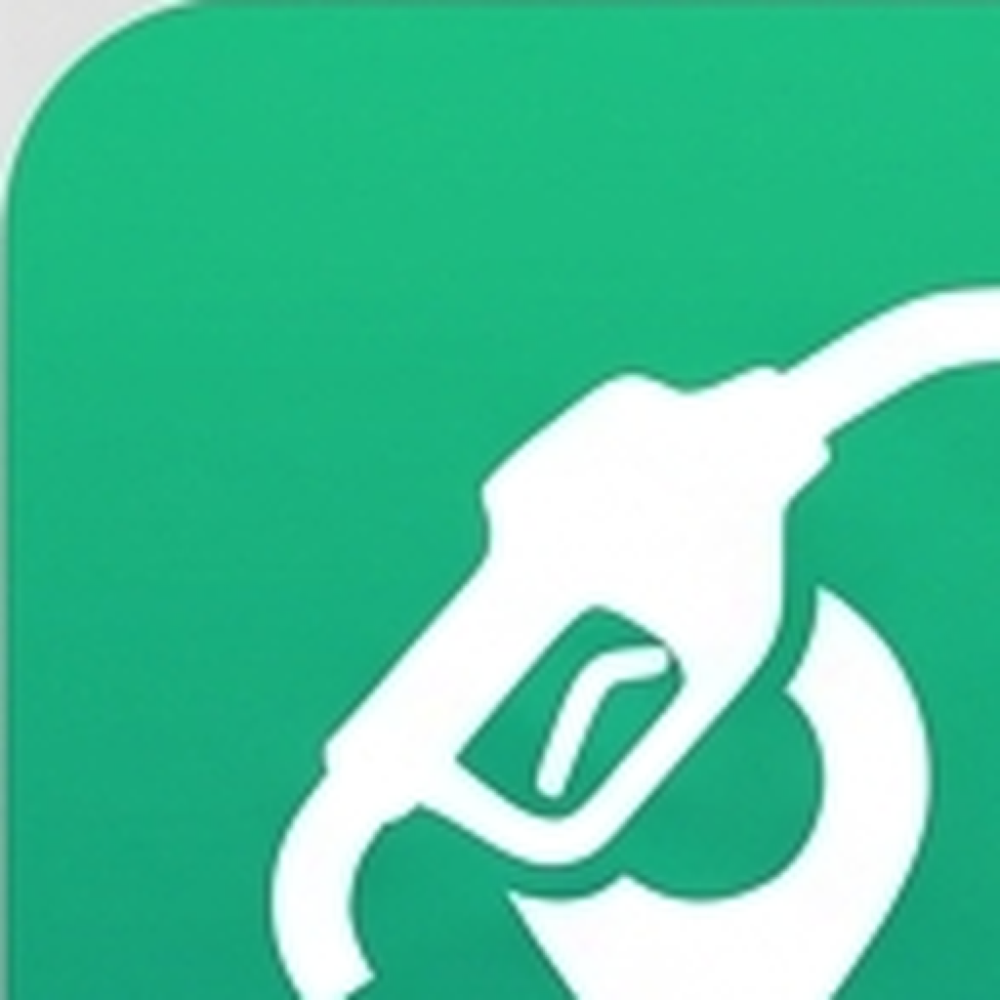
</p>

# Sparkilo

<sub>The repository, bundle id (`de.tankstellen.fuelprices`), and internal package name remain `tankstellen` — that's the project's technical identity. **Sparkilo** is the public-facing brand on the App Store, Play Store, and the app's home-screen tile.</sub>

> **The cost of driving, attacked from three sides.**
>
> A car loses you money in three places: at the pump, on the road, and in everything you forgot to track. Sparkilo tackles all three — pay less per litre, burn fewer of them per kilometre, and see exactly where the money actually went.

[](https://github.com/fdittgen-png/tankstellen/actions/workflows/ci.yml)
[](LICENSE)
[](https://flutter.dev)

<p>
  <a href="https://play.google.com/store/apps/details?id=de.tankstellen.fuelprices">
    
  </a>
  &nbsp;
  <a href="https://apps.apple.com/app/id6766543414">
    
  </a>
</p>

<sub>iPhone listing currently in <strong>TestFlight beta</strong> — the App Store page will populate once Apple's first-build review clears.</sub>

**A free, open-source companion app for cutting the running cost of your car.** 11 countries, 23 languages, privacy-first, no ads, no tracking.

Sparkilo aggregates real-time fuel prices from official government APIs, plugs into your car's OBD-II port to see how it actually drives, and keeps a tidy log of every fill-up and trip so the savings stop being theoretical.

## The objective: a cheaper kilometre

Every feature ladders up to one goal — **reduce what your car costs you, per kilometre driven** — through three layers, in priority order:

### 1. Buy fuel for less money

Live cross-country price comparison, route-aware "cheapest stop" planning, drop alerts, and 30-day price history with a "best time to fill" model. Cheap fuel is the easiest win — and the one drivers leave on the table the most.

### 2. Burn less of it per kilometre

Plug in any ELM327-compatible OBD-II adapter and the app starts coaching: live haptic eco-feedback, hard-acceleration and idling insights, a per-trip driving score, and a throttle/RPM histogram showing where your engine actually lives. Behaviour change is harder than picking a station, but it pays out on every drive instead of every fill-up.

### 3. See what you're really spending

A fill-up log (manual, receipt-OCR, or OBD-II auto-record on disconnect), per-trip cost detail, fuel-cost projections, a CO₂ dashboard, and a maintenance-suggestion engine that watches consumption drift over time. You can't reduce what you don't measure — and most drivers measure nothing.

Features that don't serve at least one of those three layers don't belong.

## Features

### Layer 1 — buying cheaper

- **Real-time prices** from each country's official government data source — no scraping
- **11 countries** — Germany, France, Austria, Spain, Italy, Denmark, Portugal, UK, Argentina, Australia, Mexico
- **23 languages** — from Bulgarian to Swedish
- **Route-aware search** — uniform / cheapest / balanced strategies, "best stops" along a planned trip
- **Cross-border suggestions** — when the next country over is meaningfully cheaper, the app says so
- **Price alerts** — threshold-based notifications, evaluated by a background job
- **Price history & predictions** — 30-day charts plus a "best time to fill" model from your local history
- **Brand filter** — Total / Esso / Shell / Aral, country-aware brand registry
- **Favorites** — quick access with swipe-to-navigate / swipe-to-remove
- **Home-screen widget** — current prices and a "predictive" variant without opening the app
- **EV charging** — OpenChargeMap integration with connector type, max power, and pricing

### Layer 2 — burning less

- **OBD-II support** — any ELM327-compatible adapter (BLE classic + dual-mode, see the adapter registry)
- **Auto-record** — pair adapter to vehicle, auto-connect on Bluetooth, auto-start on movement, auto-save on disconnect
- **Trip recorder** — speed, fuel rate, RPM, throttle %, engine load (when supported), GPS path
- **Trip detail view** — per-trip charts (speed, fuel rate, RPM, engine load) plus shareable PNG report
- **Driving insights** — hard-accel waste, idling fuel, cold-start surcharge, low-gear coaching
- **Driving score** — composite 0-100 score per trip with breakdown chips, opt-in
- **Throttle / RPM histogram** — see the engine zone you actually drive in
- **Visual eco-coach** — live haptic + on-screen feedback when behaviour costs fuel
- **Driving mode** — full-screen, in-car friendly map with large markers and voice announcements
- **Maintenance analyzer** — watches consumption drift over time, flags MAF deviation, idle creep, sluggish warm-up

### Layer 3 — seeing what you actually spend

- **Fill-up log** — manual entry, receipt OCR scan, pump-display OCR, or OBD-II auto-import on disconnect
- **Trip history** — every recorded trip with distance, duration, avg consumption, fuel used, fuel cost
- **Vehicle profiles** — combustion, hybrid, or EV; tank capacity, battery, connectors, multi-vehicle households
- **Cost calculator** — tank fill cost, cross-station savings, fuel-budget projections
- **CO₂ dashboard** — emissions per vehicle with 30-day rolling chart
- **Service reminders** — interval + mileage-driven, configurable per vehicle

### Cross-cutting

- **Local-first** — Hive storage, smart caching, offline-capable
- **Cross-device sync** — optional TankSync cloud backend (self-hostable via Supabase)
- **Privacy** — no Firebase, no Google Play Services, no Apple analytics SDKs, no tracking, no ads, GDPR-compliant
- **Accessibility** — meets Android tap-target and Apple Human Interface tap-target guidelines, semantic labels throughout
- **Platform parity** — iOS and Android share the same Dart codebase; platform-specific surfaces (BLE OBD2, background tasks, widgets) live behind plugin interfaces, never inline `Platform.isIOS` branches

## Screenshots

Captured on a Samsung Galaxy S20 (Android 14, French locale) running Sparkilo against the live `Prix Carburants` (France) API. UI is fully localised — these are the French strings; English / German renders the same screens.

### Find fuel & EV charging

| Search results | Search criteria | Map view |
|:--:|:--:|:--:|
|  |  |  |
| Real-time prices ranked by distance with brand 24h / amenity badges and a swipe-to-navigate hint. | Modal sheet for nearby vs along-route, fuel type, radius slider, and 8 amenity filters. | Interactive map with green-to-red price markers and a one-tap driving-mode launcher. |

| Map (EV) | Station detail | Price alert |
|:--:|:--:|:--:|
| 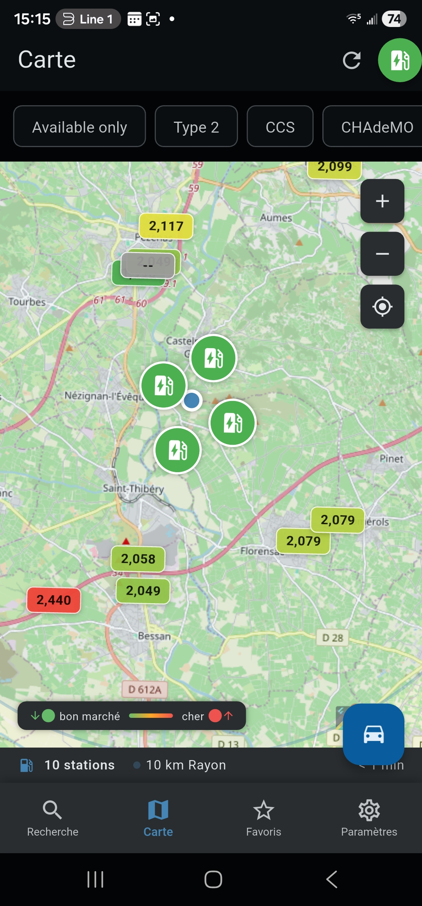 | 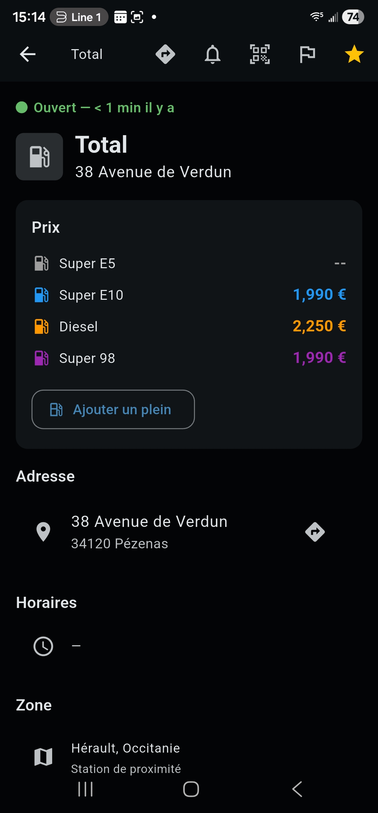 | 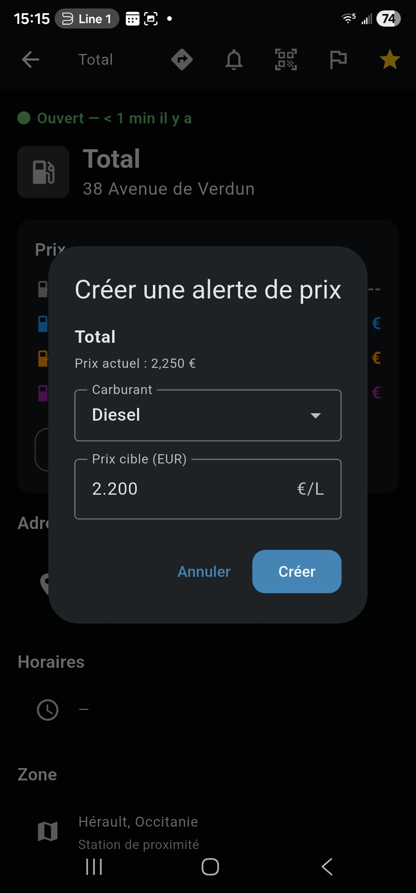 |
| Same map, EV mode: charger filter chips (Type 2 / CCS / CHAdeMO) and connector availability. | Per-fuel pricing with last-update timestamp, full address, opening hours, region badge. | Per-station, per-fuel-type threshold; the background check fires every 30 min. |

### Save & follow

| Favorites | Price alerts | Use mode |
|:--:|:--:|:--:|
|  |  |  |
| Saved stations with multi-fuel pricing and swipe-to-navigate / swipe-to-remove gestures. | Threshold-based price alerts; one toggle per station + fuel type. | First Settings section — pick the feature bundle that matches how you use the app. |

### Track your consumption (Medium + Full profiles)

| Empty state | Pick a station | Tank + stats |
|:--:|:--:|:--:|
| 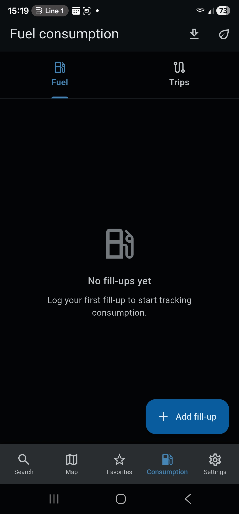 | 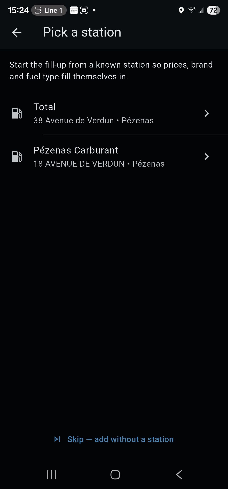 | 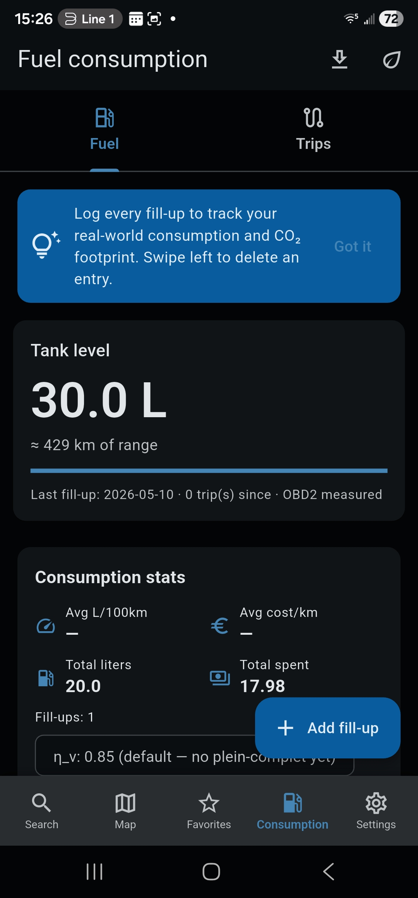 |
| Fuel + Trips tabs; empty state guides the user to the first fill-up. | Pre-fills brand, fuel type, and current price from the user's recent search results. | Live tank level (OBD2-measured when an adapter is paired) plus L/100 km, cost/km, totals. |

### Vehicle & OBD2 (Full profile)

| Pick from catalog | Service reminders + Auto-record | OBD2 + Baseline |
|:--:|:--:|:--:|
| 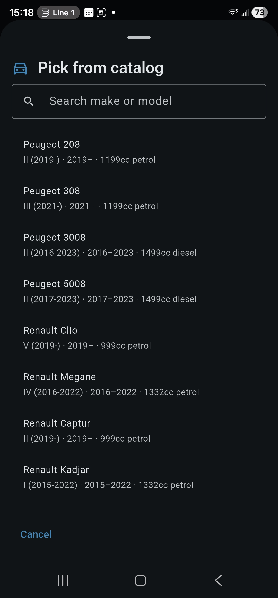 |  | 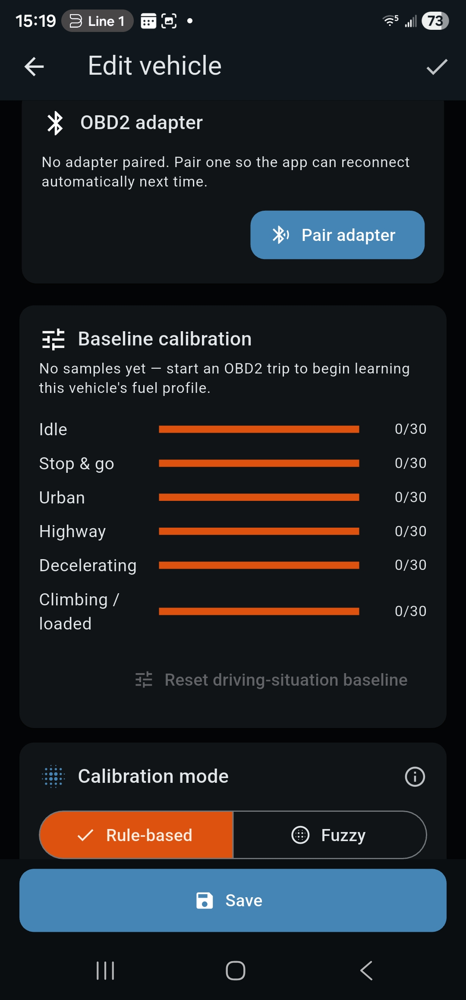 |
| 30-vehicle catalog (more landing every release) keyed by make / model / year / engine. | One-tap reminder presets + per-vehicle hands-free auto-record with configurable thresholds. | Pair an ELM327-compatible adapter and the app learns a per-driving-situation fuel baseline. |

### Privacy first

| Consent | Privacy Dashboard | Export & delete |
|:--:|:--:|:--:|
| 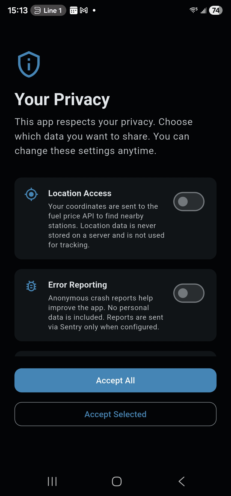 | 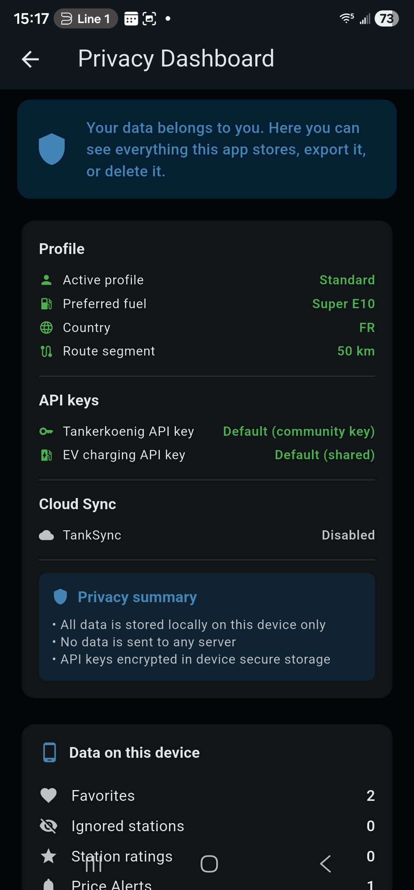 | 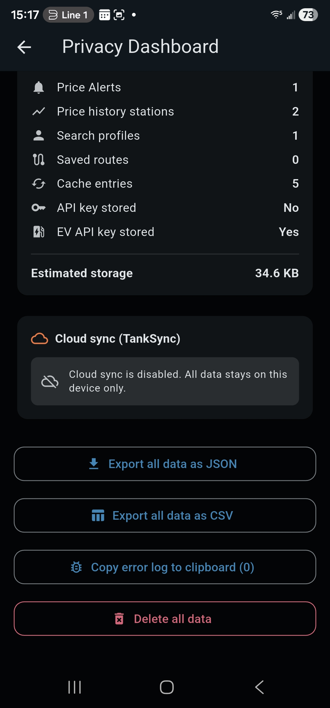 |
| Per-purpose GDPR consent at first launch — granular and revocable any time. | One-glance summary of what's stored, who has it, and which API keys are in use. | One-tap export of every stored row as JSON or CSV; one-tap delete-all. |

## Getting Started

### Prerequisites

- [Flutter SDK](https://docs.flutter.dev/get-started/install) (stable channel, 3.41+)
- **For Android builds:** Android SDK with at least one emulator or connected device, plus JDK 17
- **For iOS builds (macOS only):** Xcode 26+, CocoaPods 1.16+, Ruby 3.0+ with Bundler (see [docs/guides/ios-codesigning.md](docs/guides/ios-codesigning.md) for the fastlane match setup)

### Setup

```bash
# Clone the repository
git clone https://github.com/fdittgen-png/tankstellen.git
cd tankstellen

# Install dependencies
flutter pub get

# Run code generation
dart run build_runner build --delete-conflicting-outputs

# Launch on a connected device or emulator
flutter run
```

### API Keys

Sparkilo uses official government fuel price APIs. Some require a free API key:

| Country | API | Key Required |
|---------|-----|:------------:|
| Germany | [Tankerkoenig](https://creativecommons.tankerkoenig.de/) | Yes (free) |
| France | [Prix Carburants](https://www.prix-carburants.gouv.fr/) | No |
| Austria | [E-Control](https://www.e-control.at/) | No |
| Spain | [MiTECO](https://sedeaplicaciones.mineco.gob.es/) | No |
| Italy | [MISE](https://dgsaie.mise.gov.it/) | No |

Keys are stored securely on-device (Android Keystore on Android, iOS Keychain on iOS via `flutter_secure_storage`) — never embedded in source code.

## Architecture

```
lib/
  app/              # App entry, routing, theme
  core/
    cache/          # Unified CacheManager with TTLs
    services/       # Abstract interfaces + country implementations
    storage/        # Hive local storage
    sync/           # TankSync cloud backend (optional)
    telemetry/  # Structured error capture
  features/
    search/         # City/postal code search
    map/            # Interactive map with clustering
    favorites/      # Saved stations with swipe actions
    alerts/         # Price drop notifications
    calculator/     # Trip cost calculator
    price_history/  # 30-day charts & predictions
    route_search/   # Along-the-route cheapest station
    station_detail/ # Station info, prices, reports
    profile/        # Settings & preferences
    sync/           # Cross-device sync UI
    widget/         # Home screen widget
    ...
```

**Key patterns:**
- Feature-first clean architecture with data / domain / presentation layers
- Riverpod 3.0 with code generation for state management
- Service abstraction with 4-step fallback: fresh cache → API → stale cache → error
- All API responses wrapped in `ServiceResult<T>` with source tracking

## Development

```bash
# Run tests
flutter test

# Run tests with coverage
flutter test --coverage

# Static analysis (must pass with zero warnings)
flutter analyze

# Code generation (after changing models/providers)
dart run build_runner build --delete-conflicting-outputs

# Build release APK
flutter build apk --release
```

### Adding a New Country

The app is designed to be easily extensible. Each country has its own service implementation behind the `StationService` interface. See `lib/features/station_services/` for examples.

## Tech Stack

| Layer | Technology |
|-------|-----------|
| Framework | Flutter 3.41 / Dart 3.11 |
| State | Riverpod 3.0 with code generation |
| Storage | Hive (local-first) + optional Supabase |
| Networking | Dio 5.x with interceptors |
| Maps | flutter_map + OpenStreetMap (no Google dependency) |
| Data Classes | Freezed + json_serializable |
| Background | WorkManager for periodic alert checks |
| CI/CD | GitHub Actions — analyze, test, build, release |

## Contributing

Contributions are welcome — see [docs/CONTRIBUTING.md](docs/CONTRIBUTING.md) for the full version. Quick summary:

1. **Open an issue first** — describe the bug or feature before writing code
2. **Branch from `master`** — conventional branch names (`feat/`, `fix/`, `refactor/`, `test/`)
3. **Write tests** — every change needs tests (unit, widget, or integration)
4. **Run checks** — `flutter analyze` and `flutter test` must pass with zero warnings
5. **Keep PRs small** — under 400 lines changed (excluding generated files)
6. **Conventional commits** — `feat:`, `fix:`, `docs:`, `refactor:`, `test:`, `chore:`

A feature that doesn't ladder up to one of the three savings layers above is unlikely to be merged.

### Commit Messages

```
feat: add price alerts for Portugal stations
fix: prevent duplicate API calls during rapid scroll
refactor: extract cache TTL constants to config
```

## License

This project is licensed under the MIT License — see the [LICENSE](LICENSE) file for details.

## Acknowledgments

- Fuel price data provided by official government APIs of each supported country
- Maps powered by [OpenStreetMap](https://www.openstreetmap.org/) contributors
- Built with [Flutter](https://flutter.dev) and the amazing Dart ecosystem
