<!--
  Copyright (c) 2026 Florian DITTGEN
  SPDX-License-Identifier: MIT
-->

<p align="center">
  
</p>

# Sparkilo

<sub>The repository, bundle id (`de.tankstellen.fuelprices`), and internal package name remain `tankstellen` — that's the project's technical identity. **Sparkilo** is the public-facing brand on the App Store, Play Store, and the app's home-screen tile.</sub>

> **The cost of driving, attacked from three sides.**
>
> A car loses you money in three places: at the pump, on the road, and in everything you forgot to track. Sparkilo tackles all three — pay less per litre, burn fewer of them per kilometre, and see exactly where the money actually went.

[](https://github.com/fdittgen-png/tankstellen/actions/workflows/ci.yml)
[](LICENSE)
[](https://flutter.dev)

<p align="center">
  <a href="https://play.google.com/store/apps/details?id=de.tankstellen.fuelprices">
    
  </a>
  <a href="https://apps.apple.com/app/id6766543414">
    
  </a>
  <a href="https://fdittgen-png.github.io/tankstellen/fdroid/repo">
    
  </a>
</p>

<sub>
<strong>Google Play</strong> is the public <strong>production</strong> release. <strong>Already a beta tester?</strong> Open Testing keeps serving you beta builds (shown with a <em>(beta)</em> tag) — to switch to production, leave the testing programme on the Play listing and reinstall; or <strong>stay in beta</strong> to get new features first (every build reaches the beta channel before production). <strong>F-Droid:</strong> add the repo <code>https://fdittgen-png.github.io/tankstellen/fdroid/repo</code> for the fully Google-free build. <strong>iPhone</strong> is in <strong>TestFlight beta</strong> until Apple's first-build review clears. Full install guide: <a href="https://github.com/fdittgen-png/tankstellen/wiki/User-en-Getting-Started">wiki → Getting Started</a>.
</sub>

**A free, open-source companion app for cutting the running cost of your car.** 17 countries, 23 languages, privacy-first, no ads, no tracking.

Sparkilo aggregates real-time fuel prices from official government APIs, plugs into your car's OBD-II port to see how it actually drives, and keeps a tidy log of every fill-up and trip so the savings stop being theoretical.

## The objective: a cheaper kilometre

Every feature ladders up to one goal — **reduce what your car costs you, per kilometre driven** — through three layers, in priority order:

### 1. Buy fuel for less money

Live cross-country price comparison, route-aware "cheapest stop" planning, drop alerts, and 30-day price history with "best time to fill" guidance. Cheap fuel is the easiest win — and the one drivers leave on the table the most.

### 2. Burn less of it per kilometre

Plug in any ELM327-compatible OBD-II adapter and the app starts coaching: live haptic eco-feedback, hard-acceleration and idling insights, a per-trip driving score, and a throttle/RPM histogram showing where your engine actually lives. Behaviour change is harder than picking a station, but it pays out on every drive instead of every fill-up.

### 3. See what you're really spending

A fill-up log (manual, receipt-OCR, or OBD-II auto-record on disconnect), per-trip cost detail, fuel-cost projections, a CO₂ dashboard, and a maintenance-suggestion engine that watches consumption drift over time. You can't reduce what you don't measure — and most drivers measure nothing.

Features that don't serve at least one of those three layers don't belong.

## Features

### Layer 1 — buying cheaper

- **Real-time prices** from each country's official government open-data source — not crowdsourced, not scraped. The results header surfaces the live source and links straight to it (e.g. *France — Prix-Carburants (gouv.fr)*).
- **17 countries** — Germany, France, Austria, Spain, Italy, Denmark, Portugal, Luxembourg, Slovenia, UK, Argentina, Australia, Mexico, South Korea, Chile, Greece, Romania
- **23 languages** — from Bulgarian to Swedish, every UI surface fully translated
- **One central search button** — a docked button seated in a concave notch at the centre of the 5-tab bottom bar (Favorites · Map · **Search** · Fuel · Trips). Tap it to open the **Search criteria** sheet — Nearby vs Search-along-route, fuel-type chips (Super E10 / E5 / 98, Diesel, LPG, CNG, E85, plus EV charging), a radius slider, an *Open only* toggle, amenity filters (Shop, Car Wash, Air, WC…), a highway / no-highway filter, and *Save as my defaults*.
- **Every price side by side** — a comparison table with one row per station and one column per grade, each cell carrying the price, the gap to the cheapest, and what a tank of it would cost. A price-per-litre list cannot answer *which grade is cheapest for my car here*; this does.
- **Result sorting & detail** — *N stations found*, sort by Distance / Price / A-Z / 24h-open; each card shows price, an up/down price-trend arrow, a community star rating, amenity badges, distance, last-update time, and a one-tap favourite star.
- **Route-aware search** — plan a trip and switch between *All stations* and *Best stops*; distances are measured **along the corridor**, the cheapest stop carries a *Cheapest* badge (e.g. *117 km · 78 min · 24 stations*), and a partial-results banner means a slow country never blocks the cheap result
- **Cross-border route search** — a route that crosses a national border queries every country the corridor passes through, using each country's own data provider and the fuel grade from its matching profile. The result header credits all contributing sources (e.g. *España — Geoportal Gasolineras (MITECO) · France — Prix Carburants*). Results stream in progressively as each country's batch arrives — near stations appear first, and the full corridor populates within a few seconds.
- **Cross-border suggestions** — when the next country over is meaningfully cheaper, the app says so
- **Fuel Station Radar** — a one-tap scan centered on your current GPS position. On the search-results screen a floating *Start fuel station radar* pill launches it; the results list switches to *Fuel Station Radar result* mode and shows priced stations sorted by distance. During a trip recording a *Closest station* card is pinned to the top of the screen at all times — it shows the nearest station with its price and a proximity fill-bar, and you can swipe left/right to page through the ranked candidates. When you drive inside the station's configured radius the card locks onto that station and the approach overlay flips to the large-price PiP view.
- **Price alerts** — per-station thresholds (e.g. *Diesel ≤ 2.040 €*) plus radius alerts (e.g. *Super E10 ≤ 2.100 € · 10 km*), with an Active / Today / This week activity summary. On-device, consent-respecting, evaluated only when you're nearby.
- **Station page** — the full per-grade price table including the grades the station does *not* sell (an empty column is data, not a gap), opening hours, zone, amenities, payment methods, your private rating, and one honest price history rather than three that disagree.
- **Price history & predictions** — 30-day charts plus "best time to fill" guidance (a day-of-week + price-threshold heuristic) from your local history
- **Offline brand marks** — 60 licence-audited logos for every major European fuel brand and EV network are bundled with the app, so a station card carries its brand with no network call and no consent to give away.
- **Brand filter** — Total / Esso / Shell / Aral, country-aware brand registry
- **Favorites** — fuel stations (multi-fuel price rows: E5 / E10 / Diesel) and EV chargers (e.g. *120 kW · 3/3 available · CCS Type 2 · Type 2*) in one list, with swipe-to-navigate / swipe-to-remove; landscape splits the panel side-by-side with the alerts pane
- **Home-screen widget** — current prices in two layouts (standard + predictive), a tap that opens the right station whether the app is cold or warm, plus a refresh button that re-pulls without ever opening the app
- **EV charging** — Open Charge Map integration with connector type, max power, and live availability

### Layer 2 — burning less

- **OBD2 optional, not required** — Medium-profile users record trajets with GPS alone (no adapter); Full-profile users get the full OBD2 telemetry pipeline. Both paths produce real L/100 km figures via a per-vehicle calibration matrix that refines after every fill-up.
- **The pump is the truth** — a fill-up closes the loop: the app compares what you actually pumped against what the recordings estimated for the same tank, and derives a per-vehicle **pump calibration** from the difference. The tank report states the residual in plain words (*your recorded trips overestimate consumption by 31 %*) instead of hiding it in a coefficient.
- **Driving-situation baseline** — every OBD2 sample is filed into one of nine situations (idle, stop & go, urban, highway, decelerating, climbing / loaded, cold start, sustained load, coasting), classified **rule-based** (one situation per sample) or **fuzzy** (spread across neighbours by fit — smoother around 60 km/h and on changing gradients). The screen names the situations it has never seen rather than pretending the profile is complete.
- **GPS-only trajet recorder** — speed-band integration, accel/brake event counting, altitude grade tracking. The matrix maps the resulting feature set to an estimated L/100 km that converges toward your real-world fuel burn after 3–8 fill-ups.
- **OBD2 trajet recorder** — any ELM327-compatible adapter (BLE classic + dual-mode, see the adapter registry); fuel rate, RPM, throttle %, engine load (when supported), GPS path. Speed-density fallback for cars without PID 5E.
- **Always-both recording** — OBD2 and GPS run in parallel during every recording. Mid-trip adapter dropouts are tolerated; the trip classifies as `gpsOnly` / `gpsPlusObd2` / `hybrid` at trip end based on coverage ratio.
- **Auto-record** — pair adapter to vehicle, auto-connect on Bluetooth, auto-start on movement, auto-save on disconnect (Android-verified; iOS background-wake pending #1542).
- **Live coaching** — OBD2 trajets get shift-up / shift-down / ease-pedal tiles. GPS-only trajets get lift-off-coast / anticipate-brake / smooth-accel tiles, derived from a rolling 5-second GPS sample window.
- **Trip detail view** — a summary (vehicle, OBD2 adapter, distance, duration, avg consumption, fuel used, fuel cost, avg/max speed) plus a GPS route map colour-coded by efficiency band (*Efficient* / *Borderline* / *Wasteful*) and a shareable GPX export.
- **Eco-coaching** — a *Top wasteful behaviours* card (low-gear labouring, hard accelerations and the litres they wasted, time over a high RPM) turns each trip into a concrete "here's where the fuel went" readout.
- **"How you used the engine"** — throttle-position breakdown (Coast / Light / Firm / Wide-open %) and engine-RPM-band breakdown (Idle / Cruise / Spirited / Hard %) so you can see the engine zone you actually drive in.
- **Driving score** — composite 0-100 score per trip with breakdown chips, opt-in.
- **Visual eco-coach** — live haptic + on-screen feedback when behaviour costs fuel.
- **Driving mode** — full-screen, in-car friendly map with large markers and voice announcements; PiP overlay shows context-adaptive primary (live L/100 km if OBD2, distance if GPS-only mid-trajet, elapsed time during pre-roll — #2094) and flips to a huge price layout when you cross a station's radius (the **approach overlay**, Epic #2065).
- **Approach overlay (test before you drive)** — the Privacy Dashboard carries a "Test approach overlay" button that pushes a synthetic in-radius signal for 30 s so the PiP price flip can be verified from the couch.
- **Maintenance analyzer** — watches consumption drift over time, flags MAF deviation, idle creep, sluggish warm-up.

### Layer 3 — seeing what you actually spend

- **Fill-up log** — manual entry, pump-display OCR, receipt OCR, or OBD-II auto-import on disconnect; every fill shows L/100 km, the % delta vs the previous fill, and the €/L paid, exportable in one tap
- **Fuel tab at a glance** — live tank level + estimated range (e.g. *≈ 536 km*), a fill-up summary for the current tank (km since the last full tank, litres pumped, pump consumption, how much of it your recordings actually covered), and a consumption-stats card with an accuracy indicator (*High · ±3-7 %*), the **pump calibration** factor learned from your fill-ups, average L/100 km, average cost/km, total litres, total spent and fill-up count
- **Trip history** — every recorded trip with distance, duration, avg consumption, fuel used, fuel cost, and a this-month-vs-last comparison
- **Vehicle profiles** — combustion, hybrid, or EV; tank capacity, battery, connectors, multi-vehicle households
- **Fuel-cost calculator** — distance × consumption × price → litres, total cost, and cost/km, with smart prefill from your active vehicle and profile
- **Which fuel is cheapest to drive on** — cost per kilometre per fuel composition, from *your* measured consumption rather than a spec sheet, with the **break-even price** that makes it actionable: below 0.78 €/L, E5 wins; above it, E85 does. Runs on at least two full tanks per composition before it will crown a winner.
- **Carbon dashboard** — total cost and total CO₂, plus consumption broken down by trip length (short < 5 / medium 5-25 / long > 25 km) and by speed band (idle, urban, suburban, rural, eco-cruise, motorway, motorway-fast) with each band's share of your driving
- **Service reminders** — interval + mileage-driven, configurable per vehicle

### Cross-cutting

- **Feature-management presets** — right-size the app to how you actually use it: **Basic** (cheapest fuel + EV charging nearby, favourites, price alerts), **Medium** (+ track fill-ups and EV charging by hand), **Full** (+ automatic OBD2 trip recording, driving scores, loyalty cards), or **Custom** (à la carte). Switching is one tap in Settings.
- **One profile per country** — each profile is tied to a country and a preferred fuel grade; the app activates the matching data provider when you switch profiles. Add one profile per country you drive in — a French profile (E85 / SP95) for France, a German profile (E10) for Germany, and so on. Route-mode cross-border searches read the preferred fuel from each country's profile so every leg is priced correctly.
- **Multiple profiles** — preferred fuel, search radius, start screen, and route-planning settings per profile; the redesigned profile editor groups everything into section cards with a docked Save bar.
- **Grouped Settings** — Profile · Setup & data sources · Features & usage · Account & sync · Appearance · Privacy · About.
- **Approach-station overlay** — when you drive near a station, a Picture-in-Picture overlay flips to a big live price (Epic #2065); a *Test approach overlay* button in the Privacy Dashboard fires a synthetic in-radius signal so you can verify it from the couch.
- **Help where the question is** — a `?` beside a control opens the user guide at that exact control, in the app, in all seven guide languages. The guide is generated from the same source the wiki mirrors, so the answer on your phone and the answer on the web are the same sentence.
- **One visual grammar** — type roles, surface levels, two chip roles and one focal number per card, applied across the core screens so a number that matters looks like one and a control that acts looks like one.
- **Voice announcements** — spoken price/stop callouts while driving, in-car friendly.
- **Local-first** — Hive storage, smart caching, offline-capable.
- **Cross-device sync** — optional TankSync cloud backend (self-hostable via Supabase), free, anonymous-or-email auth, opt-in trajet sync for favourites, alerts, and trips.
- **Privacy** — no Firebase, no Google Play Services, no Apple analytics SDKs, no tracking, no ads, GDPR-compliant. API keys are sent only to the service they belong to; search coordinates go to the official price source of the country you are in; recorded GPS trips leave the device only if you switch on TankSync trip sync. The Privacy Dashboard surfaces every stored row with one-tap JSON / CSV export, a one-ZIP *Export all my data*, a "Save" button to dump the local error log, an in-app approach-overlay test surface, and a one-tap delete-all. Details in [Privacy & GDPR](#privacy--gdpr).
- **23 locales fully translated** — every UI label, including new feature surfaces; no English fallbacks except for brand names and unit masks.
- **Accessibility** — meets Android tap-target and Apple Human Interface tap-target guidelines, semantic labels throughout.
- **Cross-platform architecture** — iOS and Android share the same Dart codebase; platform-specific surfaces (BLE OBD2, background tasks, widgets) live behind plugin interfaces, never inline `Platform.isIOS` branches. Android is the verified platform; the iOS background-wake path for auto-record is pending #1542.

## Privacy & GDPR

Sparkilo is **local-first**: everything the app knows about you lives on your phone unless you switch on a feature that says otherwise. There are no ads, no advertising identifiers, no analytics SDK and no trackers. The app tells you what leaves the device, and to whom, before it happens.

- **Optional, off by default** — TankSync (cloud sync), TankSync trip sync (your recorded GPS trips), diagnostics (crash reports and performance traces to Sentry), online VIN decoding (NHTSA vPIC), the Sparkilo tile proxy (switch it off and map tiles come straight from OpenStreetMap), and internet brand logos (Clearbit). Each is a consent you give in the app and can withdraw at any time.
- **What leaves the device** — API keys are sent only to the service they belong to; search coordinates go to the official price source of the country you are in; recorded GPS trips leave the device only if you switch on TankSync trip sync.
- **Who the controller is** depends on the sync mode you pick, and the sync-mode picker says so before you connect: *no TankSync* (default) — nobody but you, nothing is stored on any server; *private database* — you, in your own Supabase project; *join a group* — the group's owner; *Sparkilo Community* — Florian DITTGEN, the developer, on Supabase hosted in the EU (AWS eu-central-1, Frankfurt), with Supabase as processor.
- **Your rights, in the app** — no support ticket needed. **Privacy Dashboard → Export all my data** writes one ZIP (a machine-readable JSON per category, one GPX per trip, your consent record and every server table). **Privacy Dashboard → Delete all data** wipes every local database and returns the app to its first-launch state. **TankSync → Data Transparency → Delete account** erases every server row you own and the account identity itself in one transaction, and names any table it could not erase instead of claiming success. **Settings → Privacy & data** lists every consent with the date you gave it and the policy version you saw; each can be switched off on the spot, and the corresponding processing stops immediately.
- Privacy policy (v3, 29 August 2026): https://fdittgen-png.github.io/tankstellen/privacy-policy/ — available in all 23 app languages.
- `docs/privacy/data_inventory.json` is the machine-readable inventory of what is processed; tests pin the privacy policy, the Play Data Safety answers, the iOS privacy manifest and this README to it, so the surfaces cannot drift apart silently.

## Screenshots

Captured 2026-09-09 on Android running Sparkilo 6.0.5 against the live `Prix-Carburants` (France) and `Geoportal Gasolineras` (Spain) open data. The UI is fully localised across 23 languages — these are the English strings; the other 22 render the same screens. The full 66-image set, including every scroll position of the long screens, lives in the [wiki guide](https://github.com/fdittgen-png/tankstellen/wiki).

### Layer 1 — buy fuel for less money

| Search criteria | Search results | Every price, side by side |
|:--:|:--:|:--:|
| 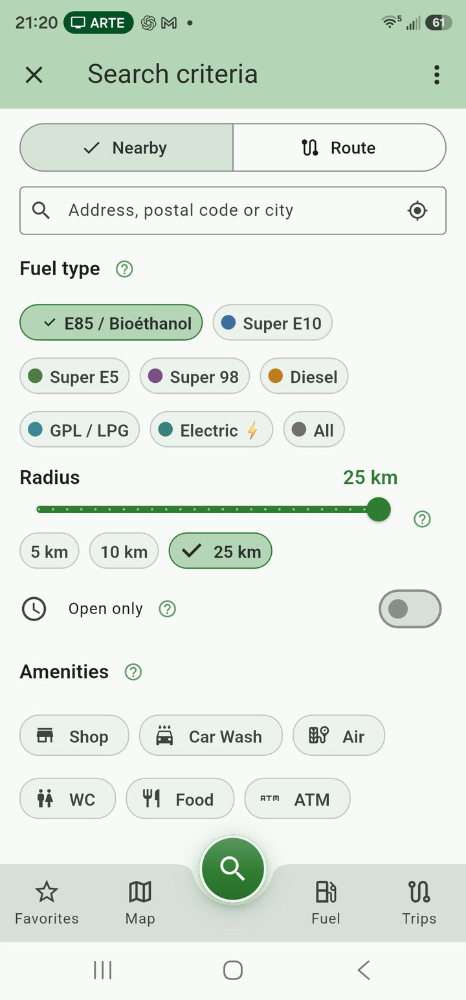 | 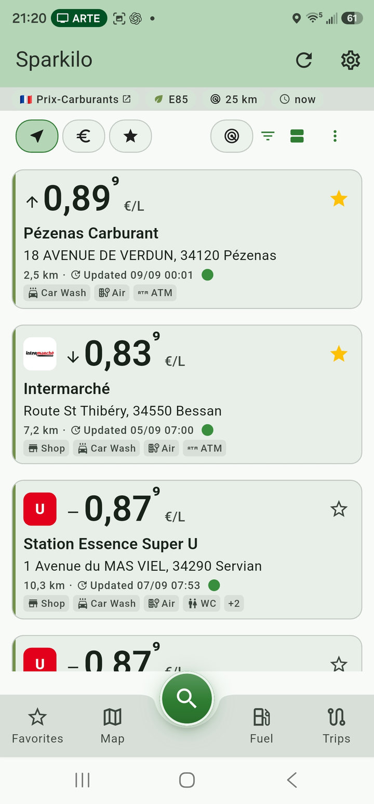 | 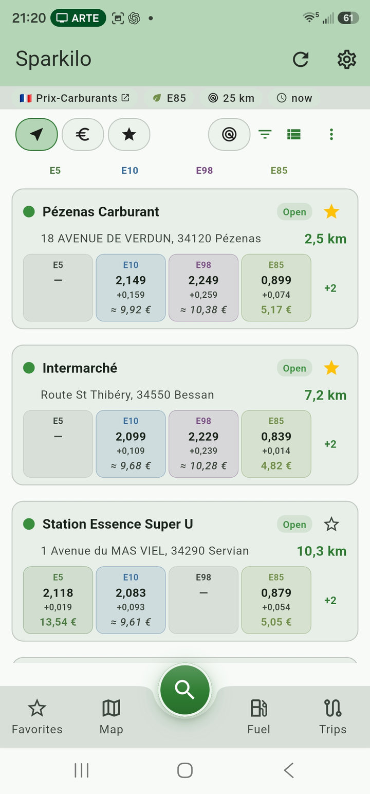 |
| One sheet behind the central search button: nearby or along a route, which grade, how far, open now, and what the forecourt must have. | Official prices with the open-data source credited and tappable. The price is the focal number; everything else is secondary by design. | The comparison table answers the question a price-per-litre list cannot: *which grade is actually cheapest for my car, here?* |

| Map | Station detail | Fuel Station Radar |
|:--:|:--:|:--:|
| 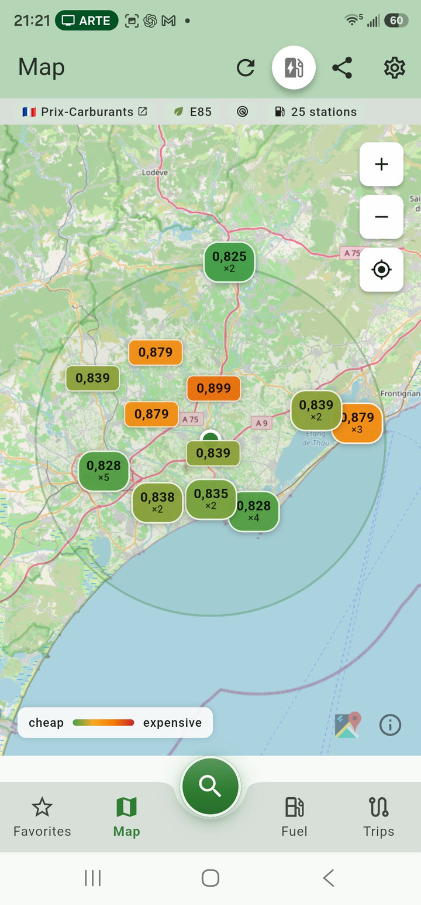 | 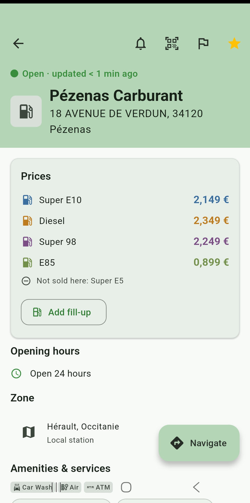 | 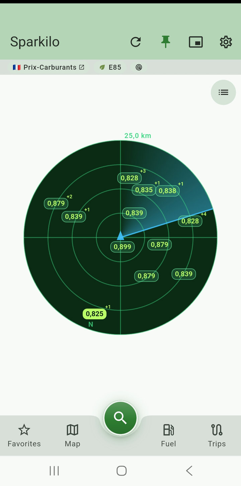 |
| Price-coloured pins relative to what is on screen, so the cheap one is obvious before you read a single number. | Every grade the station reports, including the ones it does not sell — an empty column is data, not a gap. | A one-tap scan around your GPS position: bearing, distance and price at a glance, and it keeps running while you drive. |

| Favourites | EV charging |
|:--:|:--:|
| 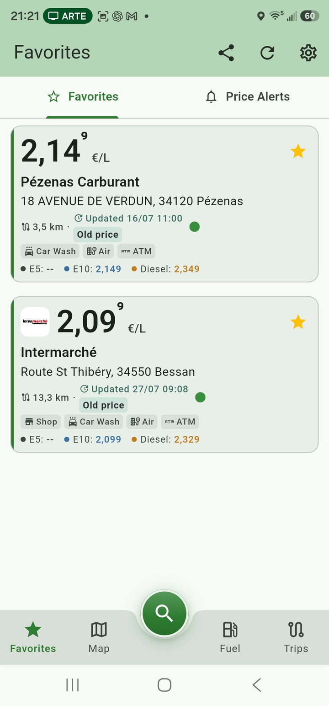 | 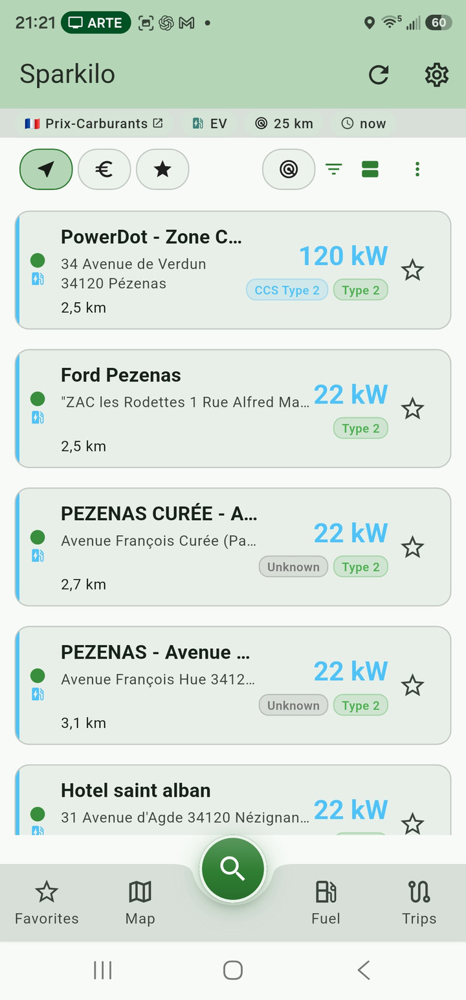 |
| The stations you actually use, with every grade they report and the alerts pane one tab away. | Open Charge Map chargers in the same list shape as fuel: power, connector, live availability. |

### Crossing a border

| Cross-border results | Best stops on the map |
|:--:|:--:|
| 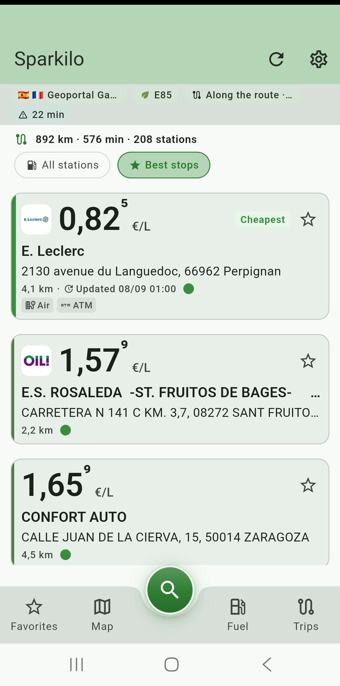 | 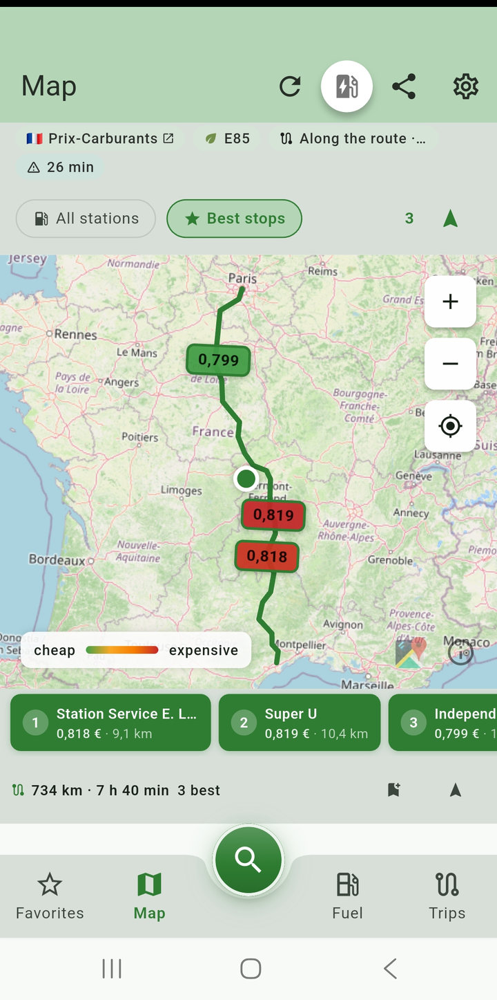 |
| A corridor that crosses a border queries every country it passes through, each with its own government source, and credits all of them. Here the French side is 0.825 € and the Spanish side 1.579 € for the same grade — the kind of gap that pays for the detour. | *Best stops* reduces 208 stations to the handful worth stopping at, measured along the corridor rather than as the crow flies. |

### Layer 2 — burn less of it per kilometre

| Trips & tank report | Route by efficiency | How you used the engine |
|:--:|:--:|:--:|
| 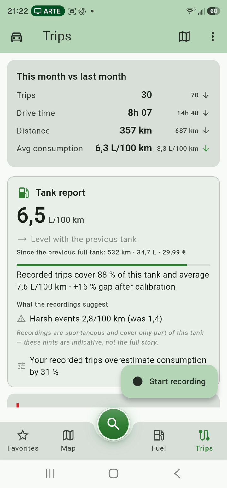 | 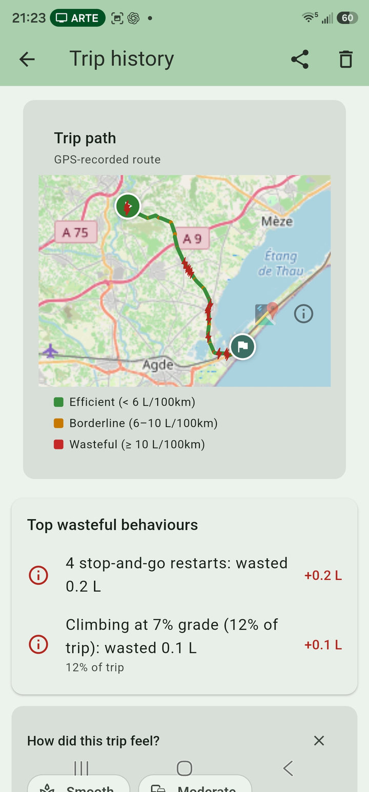 | 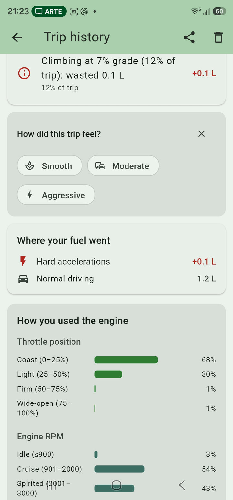 |
| The pump is the truth: the tank report compares what you actually pumped against what the recordings estimated, and says by how much they were wrong. | The route is coloured by what each segment cost, and the wasteful behaviours are priced in litres, not adjectives. | The throttle and RPM zones you actually drive in — the readout that makes "drive more gently" a specific instruction. |

| Baseline calibration |
|:--:|
| 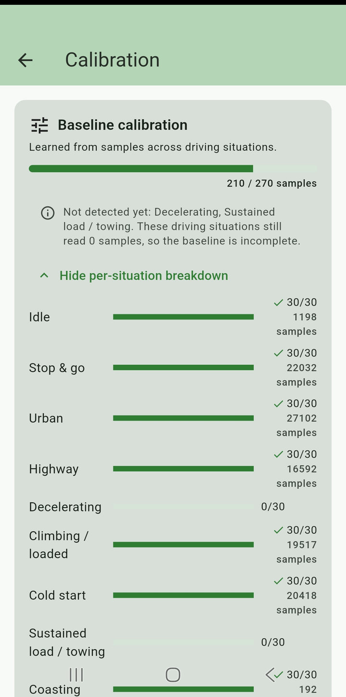 |
| Each OBD2 sample is filed into a driving situation, and the app says which situations it has never seen rather than pretending the profile is complete. Rule-based or fuzzy classification is your choice. |

### Layer 3 — see what you are really spending

| Fuel tab | Cost per kilometre by fuel | Which fuel is cheapest to drive on |
|:--:|:--:|:--:|
| 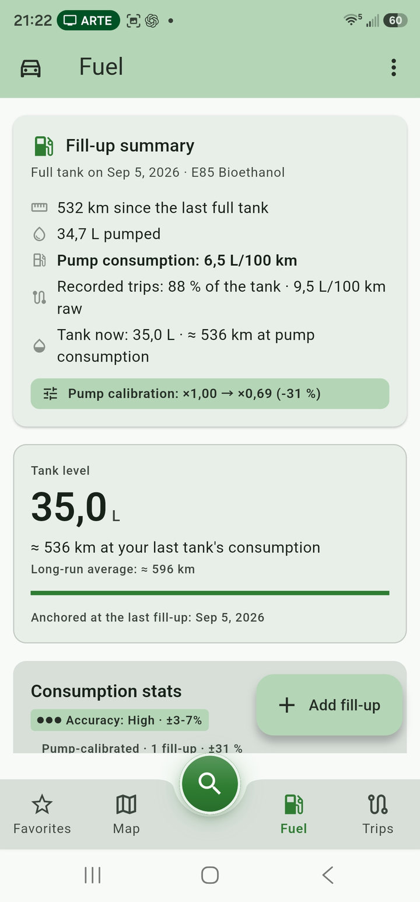 | 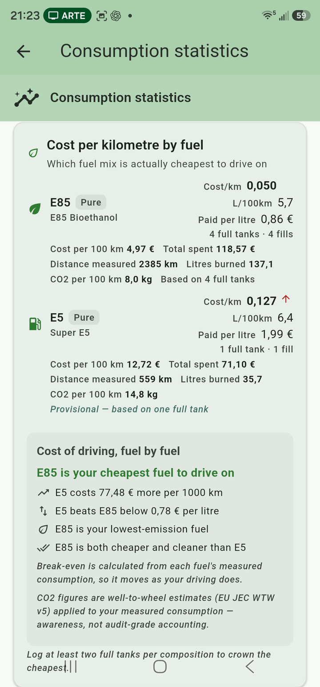 | 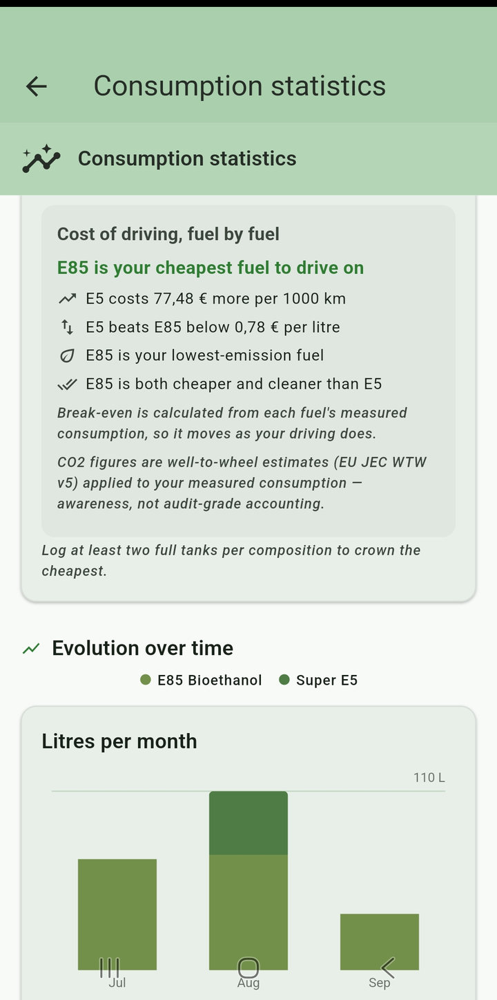 |
| One fill-up, fully accounted: what you pumped, what the recordings claimed, and the correction the pump forced on them. | Cost per kilometre per fuel, from *your* measured consumption per composition — not from a spec sheet. | The verdict, with the break-even price that makes it actionable: below 0.78 €/L, E5 wins. Above it, E85 does. |


## How it works: radar, cross-border data, and incremental loading

### Fuel Station Radar

The radar is a live scan around your current GPS position that works in two contexts:

- **On the search screen** — after a standard nearby or route search, a floating *Start fuel station radar* pill appears in the results list. Tapping it refreshes your GPS fix and runs a scan: the app fetches a 60 km wide-area corridor of station locations (cached for up to an hour so subsequent polls need no extra network calls), merges a direct in-radius fetch to guarantee the result is a superset of the regular search, and injects the priced, distance-sorted list into the results view. The pill flips to *Stop radar* to dismiss and return to the regular list.

- **During trip recording** — as soon as a GPS-only or OBD2 recording starts, a *Closest station* card is pinned permanently to the top of the recording screen. It shows the nearest priced station, its price for your preferred fuel, its distance, and a proximity fill-bar that fills from 0 % (at the radar radius edge) to 100 % (at the station forecourt). You can swipe left to jump to a nearer candidate or right to a farther one. When you actually drive inside the configured approach radius the card locks onto that station and the PiP Picture-in-Picture overlay flips to a large price view.

The radar keeps network usage minimal: station *locations* are stable (forecourts don't move), so they are cached for up to an hour; only the *price* for imminent stations is fetched just-in-time, through the same rate-limited per-country service the regular search uses.

### Cross-border data sources

Each country is backed by its own official government open-data source — there is no single aggregator. The result header always names the active source (e.g. *France — Prix-Carburants (gouv.fr)*, *España — Geoportal Gasolineras (MITECO)*, *Deutschland — Tankerkönig*). Because the sources differ, the available fuel grades, the station density, and the price-update cadence all vary across borders:

| Country | Provider | Update cadence |
|---------|----------|---------------|
| Germany | Tankerkönig (CC BY 4.0) | ~5 min |
| France | Prix Carburants (Licence Ouverte 2.0) | ~10 min (flux instantané) |
| Austria | E-Control / Spritpreisrechner (CC BY 3.0 AT) | Hourly |
| Spain | MITECO Geoportal Gasolineras | Daily bulk (local-filtered) |
| Italy | MIMIT osservaprezzi (IODL 2.0) | Daily bulk |
| UK | CMA Fuel Finder (OGL v3.0) | Twice daily bulk |
| Luxembourg | gouvernement.lu (CC0 1.0) | Daily |
| Portugal | DGEG (preçoscombustíveis) | Daily |
| Denmark | OK / Shell / Q8 aggregate | Every few hours |
| South Korea | OPINET / KNOC (KOGL Type 1) | ~30 min |
| Argentina | Secretaría de Energía | Daily bulk |
| … | Country-specific government source | Varies |

A route that crosses a border queries **all** countries the corridor passes through — each with its own service — and the results header credits every source that returned at least one priced station. A station that appears as `--` on one side of the border may be fully priced on the other because the two providers track different fuel grades.

### One profile per country

Each profile is tied to a country and a preferred fuel grade. The app activates the matching data provider when you switch profiles, and route-mode cross-border searches read the preferred fuel from each country's profile so every leg is priced in the right grade (e.g. SP95-E5 for your French leg, Super E10 for your German leg). Add one profile per country you drive in — you can switch between them at any time or let the route search pick them automatically.

### Incremental (progressive) loading

Route searches sample the corridor at regular intervals, query each country's service for those sample points, and stream partial results to the UI as each batch arrives. You will see the first stations appear within a second or two; the full result set (the *N stations found* count in the header) populates as the remaining batches resolve. A *still loading* indicator in the header shows when a sweep is in progress. The cheapest stop badge and segment-best stops update each time a new batch arrives, so they converge on the final answer rather than appearing all at once at the end.

## Getting Started

### Prerequisites

- [Flutter SDK](https://docs.flutter.dev/get-started/install) — **3.44.9**, the version CI pins and `pubspec.lock` requires
- **For Android builds:** Android SDK with at least one emulator or connected device, plus JDK 17
- **For iOS builds (macOS only):** Xcode 26+, CocoaPods 1.16+, Ruby 3.0+ with Bundler (see [docs/guides/ios-codesigning.md](docs/guides/ios-codesigning.md) for the fastlane match setup)

### Setup

```bash
# Clone the repository
git clone https://github.com/fdittgen-png/tankstellen.git
cd tankstellen

# Install dependencies
flutter pub get

# Run code generation
dart run build_runner build --delete-conflicting-outputs

# Launch on a connected device or emulator
flutter run
```

### API Keys

Sparkilo uses official government fuel price APIs. Some require a free API key:

| Country | API | Key Required |
|---------|-----|:------------:|
| Germany | [Tankerkoenig](https://creativecommons.tankerkoenig.de/) | Yes (free) |
| France | [Prix Carburants](https://www.prix-carburants.gouv.fr/) | No |
| Austria | [E-Control](https://www.e-control.at/) | No |
| Spain | [MiTECO](https://sedeaplicaciones.mineco.gob.es/) | No |
| Italy | [MISE](https://dgsaie.mise.gov.it/) | No |
| Denmark, Portugal, Luxembourg, Slovenia, UK, Argentina, Australia, Mexico, South Korea, Chile, Greece, Romania | Country-specific government sources | No |

Keys are stored securely on-device (Android Keystore on Android, iOS Keychain on iOS via `flutter_secure_storage`) — never embedded in source code.

## Architecture

```
lib/
  app/              # App entry, routing, theme
  core/
    cache/          # Unified CacheManager with TTLs
    country/        # Country registry + ServiceSource enum
    storage/        # Hive local storage
    sync/           # TankSync cloud backend (optional)
    telemetry/      # Structured error capture
    ...             # location, network, notifications, navigation, theme, …
  features/
    search/             # Nearby + along-route search
    map/                # Interactive map with clustering
    favorites/          # Saved stations + EV chargers, swipe actions
    alerts/             # Price-drop + radius notifications
    calculator/         # Fuel-cost calculator
    price_history/      # 30-day charts & predictions
    route_search/       # Along-the-route cheapest stops
    station_services/   # StationService interface + 17 country implementations
    station_detail/     # Station info, prices, reports
    consumption/        # Fill-up log + tank/consumption stats
    carbon/             # CO₂ + consumption dashboard
    driving/            # Trips, trip detail, eco-coaching
    ev/                 # EV charging (Open Charge Map)
    feature_management/ # Basic / Medium / Full / Custom presets
    profile/            # Profiles & settings
    sync/               # Cross-device sync UI
    widget/             # Home-screen widget
    ...
```

**Key patterns:**
- Feature-first clean architecture with data / domain / presentation / providers layers
- Riverpod 3.0 with code generation for state management
- Country support is consolidated onto one `CountryServiceEntry` in the registry — each country implements the `StationService` interface in `lib/features/station_services/<country>/`
- Service abstraction with a 4-step fallback: fresh cache → API → stale cache → error
- All API responses wrapped in `ServiceResult<T>` with source tracking

## Development

```bash
# Run tests
flutter test

# Run tests with coverage
flutter test --coverage

# Static analysis (must pass with zero warnings)
flutter analyze

# Code generation (after changing models/providers)
dart run build_runner build --delete-conflicting-outputs

# Build release APK
flutter build apk --release
```

### Adding a New Country

The app is designed to be easily extensible. Each of the 17 supported countries has its own service implementation behind the `StationService` interface in `lib/features/station_services/<country>/`. Since the registry was consolidated, adding a country is **one new file** (the service) plus **two small appends** (the `CountryServiceEntry` registry entry and the `ServiceSource` enum value). See [docs/guides/NEW_COUNTRY.md](docs/guides/NEW_COUNTRY.md) for the full walkthrough.

## Tech Stack

| Layer | Technology |
|-------|-----------|
| Framework | Flutter 3.44.9 / Dart 3.12 |
| State | Riverpod 3.0 with code generation |
| Storage | Hive (local-first) + optional Supabase |
| Networking | Dio 5.x with interceptors |
| Maps | flutter_map + OpenStreetMap (no Google dependency) |
| Data Classes | Freezed + json_serializable |
| Background | WorkManager for periodic alert checks |
| CI/CD | GitHub Actions — analyze, test, build, release |

## Contributing

Contributions are welcome — see [docs/CONTRIBUTING.md](docs/CONTRIBUTING.md) for the full version. Quick summary:

1. **Open an issue first** — describe the bug or feature before writing code
2. **Branch from `master`** — conventional branch names (`feat/`, `fix/`, `refactor/`, `test/`)
3. **Write tests** — every change needs tests (unit, widget, or integration)
4. **Run checks** — `flutter analyze` and `flutter test` must pass with zero warnings
5. **Keep PRs small** — under 400 lines changed (excluding generated files)
6. **Conventional commits** — `feat:`, `fix:`, `docs:`, `refactor:`, `test:`, `chore:`

A feature that doesn't ladder up to one of the three savings layers above is unlikely to be merged.

### Commit Messages

```
feat: add price alerts for Portugal stations
fix: prevent duplicate API calls during rapid scroll
refactor: extract cache TTL constants to config
```

## License

This project is licensed under the MIT License — see the [LICENSE](LICENSE) file for details.

## Acknowledgments

- Fuel price data provided by official government APIs of each supported country
- Maps powered by [OpenStreetMap](https://www.openstreetmap.org/) contributors
- Built with [Flutter](https://flutter.dev) and the amazing Dart ecosystem
